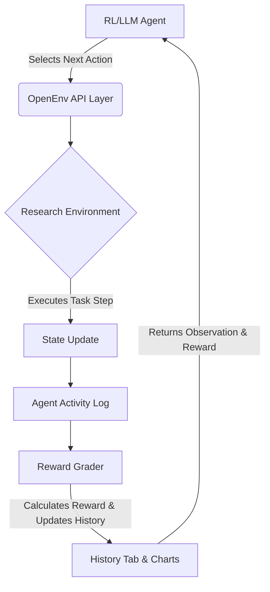

# AI Research Scientist Environment

An **OpenEnv-compliant** environment that simulates scientific research workflows for evaluating AI reasoning agents.

Unlike traditional environments that focus on task execution or coding, this environment models the **end-to-end research process** where an autonomous agent must read papers, form hypotheses, design experiments, execute them, analyze results, and draw conclusions.

---

## Table of Contents

- [Architecture](#architecture)
- [Prerequisites](#prerequisites)
- [Installation](#installation)
- [Run](#run)
- [The Simulation Loop Architecture](#the-simulation-loop-architecture)
- [Tasks & Graders](#tasks--graders)
- [Agent Actions](#agent-actions)
- [Reward Function](#reward-function)
- [Pipeline Stage Rewards / Collaboration / Penalties](#pipeline-stage-rewards--collaboration--penalties)
- [Five Adversarial Scenarios](#five-adversarial-scenarios)
- [Training Pipeline](#training-pipeline)
- [Project Structure](#project-structure)
- [Configuration](#configuration)
- [License](#license)
- [Author](#author)
- [Hackathon](#hackathon)

---

## Architecture

The system transitions traditional MDP benchmarks into a **Full-Stack Serverless Application** composed of a stunning React dashboard and a robust Python backend leveraging FastAPI.

```text
┌────────────────────────────────────────────────────────┐
│                   Web User Interface                  │
│       React + Vite + Zustand + Recharts + Tailwind    │
│   (User drives Auto-Pilot or manual execution)        │
└──────────────┬────────────────────────────┬────────────┘
               │ HTTP POST /api/agent       │ HTTP POST /step
               ▼                            ▼
┌────────────────────────────────────────────────────────┐
│               FastAPI Backend (server/app.py)          │
│                                                        │
│   ┌────────────────┐         ┌─────────────────────┐   │
│   │ HF Serverless  │         │ ResearchEnvironment │   │
│   │ Inference API  │         │ (environment.py)    │   │
│   └───────┬────────┘         └─────────┬───────────┘   │
└───────────┼────────────────────────────┼───────────────┘
            │ Qwen2.5-72B-Instruct       │ Graders & 
            │ LLM Inference API          │ Tasks
            ▼                            ▼
```

## Prerequisites

- **Python 3.11+**
- **Node.js 18+**
- **Hugging Face Account** with an Access Token (`HF_TOKEN`)

## Installation

### 1. Install Backend Dependencies
```bash
pip install -r requirements.txt
```

### 2. Install Frontend Dependencies
```bash
cd dashboard
npm install
```

## Run

### Local Development

Start the Backend Server (FastAPI):
```bash
python -m uvicorn server.app:app --host 0.0.0.0 --port 7860
```

Start the Frontend Server (Vite):
```bash
cd dashboard
npm run dev
```

### Production Build (Hugging Face Spaces)
The project is built to rely on a native Dockerfile for HF Spaces.
```bash
# Build the React UI internally
cd dashboard && npm run build && cd ..

# The Docker build natively serves the static dist folder
docker build -t ai-research-environment .
docker run -p 7860:7860 ai-research-environment
```

---

## The Simulation Loop Architecture



---

## Tasks & Graders

The environment ships with deterministic, multi-factor graders evaluating the agent against predefined structured tasks evaluating logic consistency.

| Task | Difficulty | Steps | Domain | Challenge |
|------|-----------|-------|--------|-----------|
| `task_easy_image_classification` | 🟢 Easy | 8 | Computer Vision | Clear signal, minimal noise |
| `task_medium_nlp_sentiment` | 🟡 Medium | 12 | NLP | Noisy results, misleading papers |
| `task_hard_tabular_prediction` | 🔴 Hard | 15 | Healthcare ML | Conflicting evidence, budget limit |

---

## Agent Actions

Agents have a predefined set of tools to mimic real-world machine learning research workflows:

| Action | Description |
|--------|-------------|
| `read_paper` | Read paper summaries for domain knowledge |
| `propose_hypothesis` | Form an initial hypothesis |
| `design_experiment` | Specify method + dataset combination |
| `run_experiment` | Execute a designed experiment |
| `analyze_results` | Get structured analysis of results |
| `refine_hypothesis` | Update hypothesis based on evidence |
| `final_answer` | Submit conclusion (ends episode) |

---

## Reward Function

The reward function enforces strict alignment with the scientific method using a **dense, continuous weighted evaluation system** instead of sparse binary signals. Each component is independently scored in `graders.py` and combined via a difficulty-scaled weighted sum.

### Final Reward Formula

```python
# graders.py — grade_episode()
score = w[0]*h + w[1]*e + w[2]*i + w[3]*r + w[4]*f + w[5]*t

# No final_answer submitted → score penalized by 40%
if not state_dict.get("final_answer"):
    score *= 0.6
```

### Difficulty-Scaled Weights (Real Values)

```python
# graders.py — weights dict (h, e, i, r, f, t)
weights = {
    "easy":   (0.25, 0.15, 0.30, 0.10, 0.10, 0.10),
    "medium": (0.20, 0.20, 0.25, 0.10, 0.15, 0.10),
    "hard":   (0.15, 0.25, 0.20, 0.10, 0.20, 0.10),
}
# Order: hypothesis · experiment · improvement · reasoning · final_answer · trajectory
```

### Component Breakdown (Source: `graders.py`)

| # | Component | Easy | Medium | Hard | Scoring Formula |
|---|-----------|:----:|:------:|:----:|-----------------|
| `h` | **Hypothesis Quality** | `0.25` | `0.20` | `0.15` | Keyword overlap between `current_hypothesis` and task `ground_truth_keywords` |
| `e` | **Experiment Quality** | `0.15` | `0.20` | `0.25` | `0.6 × diversity + 0.4 × found_optimal − 0.2 × repetition_penalty` |
| `i` | **Improvement Score** | `0.30` | `0.25` | `0.20` | `(best_accuracy − baseline) / (optimal − baseline)`, capped at `1.0` |
| `r` | **Reasoning Quality** | `0.10` | `0.10` | `0.10` | Sequence score: `read→hypothesis (+0.3)`, `design→run (+0.3)`, `analyze (+0.2)`, `refine (+0.2)` |
| `f` | **Final Answer Quality** | `0.10` | `0.15` | `0.20` | `0.5 × keyword_overlap + 0.5 × Jaccard_similarity` vs ground truth |
| `t` | **Trajectory Learning** | `0.10` | `0.10` | `0.10` | Fraction of consecutive experiments showing accuracy improvement |

### Step-Level Reward Signals (Source: `environment.py`)

| Action | Reward Signal | Notes |
|--------|:-------------:|-------|
| `read_paper` | `+0.05 × n_papers` | Diminished to `+0.01` on redundant re-read |
| `propose_hypothesis` | `+0.05 + 0.20 × quality + 0.05 bonus` | Bonus if papers were read first |
| `design_experiment` | `+0.03` | Per valid `method_id:dataset_id` design |
| `run_experiment` (new best) | `+0.02 + min(0.30, improvement)` | `improvement = accuracy − baseline` |
| `run_experiment` (no improvement) | `−0.01` | Fails to beat current best |
| `run_experiment` (duplicate) | `−0.05` | Exact same method+dataset combo |
| `analyze_results` | `+0.05 + 0.05 trend_bonus` | Trend bonus if last > previous accuracy |
| `refine_hypothesis` | `+0.03 + 0.10 × quality_delta` | `−0.02` if quality regresses |
| `final_answer` | `+0.10 + 0.50 × final_score` | `−0.10` if no experiments were run |
| **Repeated action type** | `−0.03` | Applied on any consecutive duplicate action type |
| **Invalid action** | `−0.10` | Unknown `action_type` submitted |
| **Max steps without `final_answer`** | `−0.20` | Episode forcibly terminated |

**Characteristics:**
- ✅ Dense and incremental — every action yields a non-zero signal
- ✅ Difficulty-aware — `improvement` score has highest weight on Easy, `experiment quality` is highest on Hard
- ✅ Penalizes hallucinations (guessing without running experiments)
- ✅ Rewards correct scientific ordering (`read → hypothesize → design → run → analyze → answer`)
- ✅ Trajectory learning rewards iterative refinement, not lucky one-shot guesses

---

## Pipeline Stage Rewards / Collaboration / Penalties

### Stage Rewards
- **`read_paper`**: Positive scalar for first-time reading, reduced returns for redundant reads.
- **`propose_hypothesis`**: High reward for synthesizing correct insights from papers.
- **`design_experiment`**: Positive tracking for selecting robust datasets/methodologies.
- **`run_experiment`**: Heavy algorithmic weighting based on statistical performance.
- **`analyze_results`**: Moderate reward for successfully calculating metrics.

### Collaboration & History
- Includes a fully instrumented **History Log Viewer** allowing the user to logically trace and compare individual Autopilot iterations, recording final scores and execution metrics relative to the mathematical maximum achievable score.

### Penalties
- **Hallucinations:** Significant penalties for guessing experimental results without running them.
- **Sequence Errors:** Firing `analyze_results` before `run_experiment` incurs a logic penalty.
- **Format Errors:** Falling back from strict JSON schema limits cumulative score upside.

---

## Five Adversarial Scenarios

The environment's dynamic configurations allow for deploying specific challenging paradigms against the reasoning agent:

1. **Misleading Literature:** Text containing adversarial information intended to poison hypothesis formulation.
2. **Saturated Budgets:** Tasks evaluating computational efficiency, penalizing grid-search style brute-forcing.
3. **Overfitting Pitfalls:** Training environments with noisy sub-labels that look highly accurate initially but crash in testing.
4. **False Positive Results:** Analysis tools that emit conflicting or stochastic metric returns.
5. **Absent Context:** Scenarios where background literature is blank, requiring fully unsupervised deduction to proceed.

---

## Training Pipeline

This environment operates seamlessly inside Reinforcement Learning workflows. Because the step API is fully `OpenENV` compliant, it maps fluently to standard `gym.Env` wrappers. You can construct continuous PPO loops taking the JSON output, calculating the cumulative `score`, and performing back-propagation on policy networks without writing any new logic.

---

## Project Structure

```text
├── models.py           # Action, Observation, State dataclasses
├── tasks.py            # Task definitions (easy, medium, hard)
├── graders.py          # Deterministic multi-factor graders
├── environment.py      # Core environment (reset/step/state loop)
├── inference.py        # Baseline automated execution logic
├── server/
│   ├── __init__.py
│   └── app.py          # FastAPI HTTP Serverless integration
├── dashboard/          # React + Vite UI
│   ├── src/
│   │   ├── components/ 
│   │   ├── store/      # Zustand state management
│   │   ├── hooks/      
│   │   └── types/      # Front-end Typings
│   ├── index.html 
│   └── package.json
├── openenv.yaml        # OpenEnv manifest
├── Dockerfile          # Container definition
├── requirements.txt    # Python dependencies
└── README.md           # This file
```

---

## Configuration

For proper LLM proxy execution, the Hugging Face server must be provided a token. Add the following to your Space's repository secrets, or to a `.env` in local development:

```env
HF_TOKEN=hf_xxxxxxxxxxxxxxxxx
```

---

## License

This project is licensed under the **[MIT License](LICENSE)**.

## Author

Created by **Team one way**.

## Hackathon

Developed for the **Meta Python OpenENV hackathon 2026**.
